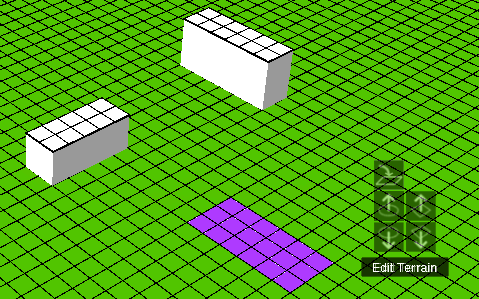
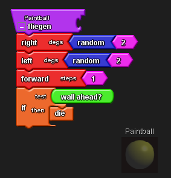
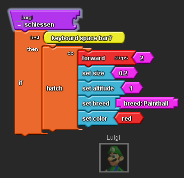
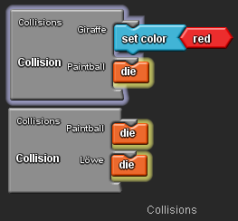
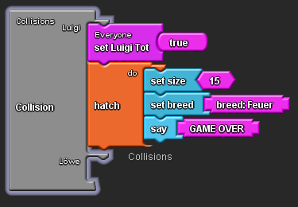
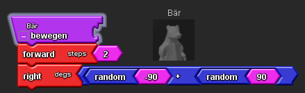

# Projektpraesentation-Informatikprojekt-3-Nele-und-Marit

## Projekt 1: Paintballspiel

Das erste Projekt dieses Informatikprojektes stellt der Ego-Shooter dar, den wir bereits in unserem zweiten Informatikprojekt angefangen hatten. Wir ergänzten das Spiel um Wände, welche im Spaceland stehen und Luigi daran hindern, sich frei zu bewegen. 
Um Wände zu erstellen benutzt man den Terrain Editor. Mit Hilfe des Drawing Tools kann man die Wände zwecks besserer Übersichtlichkeit bunt anmalen. Damit die Paintbälle, Tiere und Luigi nicht einfach durch die Wände durchlaufen benutzt man den "wall ahead" Block in Verbindung mit einem "if-test-then" Block und lässt sie sich drehen, wenn sie auf eine Wand treffen. Die Paintbälle lässt man mit Hilfe eines "die" Blockes verschwinden.

Hauptfigur dieses Spiels ist der mit den Pfeiltasten steuerbare Luigi. Durch drücken der Leertaste werden Paintbälle erstellt. Hierzu muss man die "hatch"- Funktion benutzen. Diese erstellt zunächst eine Kopie des Luigi. Dann muss man eine neue Art, den Paintball, erstellen. Mit Hilfe des "set Breed" Blockes verwandelt man die Luigi-Kopie in einen Paintball. Damit die Giraffen und Löwen abgeschossen werden können programmiert man zwei neue Kollisionen. Mit Hilfe eines "die" Blockes lässt man die Löwen sterben, wenn sie getroffen werden. Die Giraffen verfärben sich nur rot. Auch die Paintbälle verschwinden, wenn sie etwas getroffen haben.

Die Löwen bewegen sich genau wie die Giraffen willkürlich im Spaceland. Auch hierzu programmiert man Prozeduren. Trifft ein Löwe auf Luigi, so frisst er diesen und das Spiel ist vorbei. Auch hierzu benutzt man einen Kollisionsblock. Mit Hilfe von "die" Blöcken lässte man alle Charaktere des Spiels verschwinden. Außerdem erstellt man mit der hatch-Funktion das Feuer, genau so wie man vorher die Paintbälle erstellt hat. Das Feuer erscheint nun groß. Man benutzt einen "say" Block, um den Schriftzug "game over" erscheinen zu lassen. Wird Luigi von einem Löwen gefresse, erscheinen nun das Feuer und der Schriftzug.

## Projekt 2: Epidemie

Die nächste Aufgabe bestand darin, eine Epidemie zu programmieren. In unserem Spaceland gibt es Bären. Für diese Bären programmiert man eine Prozedur, die sie sich zufällig im Spaceland bewegen lässt. 

Die Bären können die Eigenschaft "ist Krank" besitzen. Ein gewisser, einstellbarer Anteil der Bären ist von Anfang an krank. Hierzu programmiert man einen Slider im setup-Bereich. Auch einstellbar ist die Wahrscheinlichkeit, dass ein gesunder Bär sich ansteckt, wenn er mit einem kranken Bären zusammenstößt. Hierzu benötigt man einen Kollisionsblock und einen zweiten Slider. Die Wahrscheinlichkeiten programmiert man, indem man testen lässt, ob eine Zahl zwischen eins und hundert, welche jeder Bär zufällig zugeordnet bekommt, kleiner oder gleich einer zweiten Zahl ist, welche sich mit dem Slider einstellen lässt. So entspricht die Zahl, die man mit dem Slider einstellt der Ansteckungswahrscheinlichkeit in Prozent. 

Es gibt die Möglichkeit, dass kranke Bären wieder gesund werden und dann immun sind. Auch die Wahrscheinlichkeit, dass das passiert lässt sich einstellen. Hierzu benutzt man einen weiteren Slider, genau so wie bei der Ansteckungswahrscheinlichkeit. Außerdem erstellt man die Eigenschaft "ist immun", die dann als Wahr oder falsch wiedergegeben wird. Damit immune Bären nicht mehr krank werden können, muss man den Kollisionsblock verändern, indem man vorher die Ansteckungswahrscheinlichkeit programmiert hatte. Man muss als eine weitere Bedingung dafür, dass der Bär die Eigenschaft "ist krank" bekommen kann hinzufügen, dass er nicht die Eigenschaft "ist immun" besitzt.  Gesunde Bären sind blau, kranke rot. Immune Bären färben sich grün. Einen Überblick über die Bären und ihre Eigenschaften kann man sich Mit Hilfe eines Bakendiagrammes verschaffen, welches sich unter dem Spaceland befindet und die Bären, die die jeweiligen Eigenschaften besitzen zählt.
